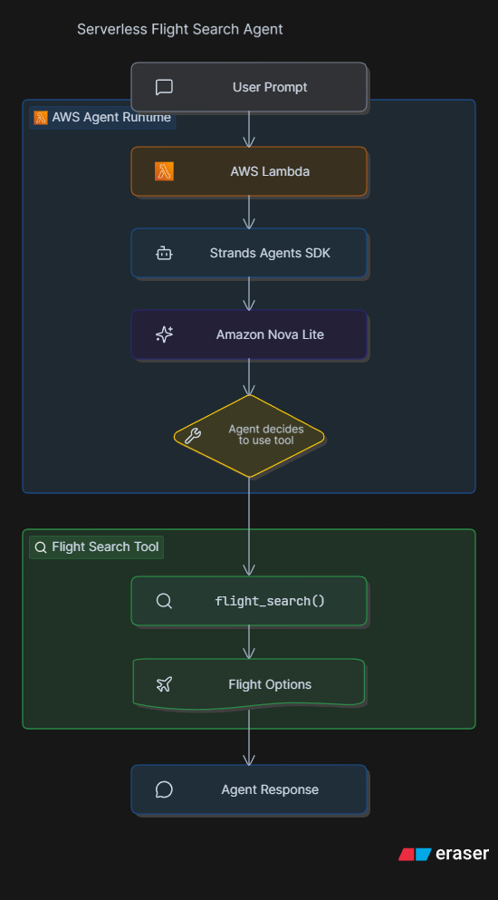

# Module 1 — Building the Agent

Part of the **[Building and Scaling Agentic AI Workflows](https://catalog.workshops.aws/workshops/eb18d538-bf1f-49b9-9747-c474953deee1/en-US)** workshop powered by Amazon Builder Centre.


## Overview

Built the first version of a **Travel Agent** using the **Strands Agents SDK**, deployed on AWS Lambda with Amazon Bedrock.

The agent can use a custom `flight_search` tool to provide airline options for a destination.

## Architecture Diagram



## Implementation

The agent was built using:

* Python
* AWS Lambda
* Amazon Bedrock
* Amazon Nova Lite
* Strands Agents SDK
* Custom `flight_search` tool

### Test Event

**Input**

```json
{
  "prompt": "What airlines can I take to Atlanta?"
}
```

**Output**

```text
The available flight options to Atlanta are:

1. Delta Airlines
2. Southwest Airlines
```

## Troubleshooting

Initially encountered:

```text
ValidationException:
The provided model identifier is invalid.
```

Verified the available Bedrock models using:

```bash
aws bedrock list-foundation-models --region us-west-2 | grep nova
```

Updated the model ID from:

```text
us.amazon.nova.lite-v1:0
```

to:

```text
amazon.nova-lite-v1:0
```

After redeployment, the agent executed successfully.

## Key Learnings

* Created an AI Agent using Strands Agents SDK
* Created and registered a custom tool
* Connected Strands Agent with Amazon Bedrock
* Deployed the agent using AWS Lambda
* Tested the agent using Lambda Test Events
* Troubleshot Bedrock model configuration using AWS CLI

## Workshop Progress

| Module | Topic                          | Status      |
| ------ | ------------------------------ | ----------- |
| 1      | [Building the Agent](../module-01-building-the-agent/)             | ✅ Completed |
| 2      | [Interacting with External APIs](../module-02-interacting-with-external-apis/) | 🔜 Next     |
| 3      | TBD                            | ⏳           |
| 4      | TBD                            | ⏳           |
| 5      | TBD                            | ⏳           |
| 6      | TBD                            | ⏳           |
| 7      | TBD                            | ⏳           |

